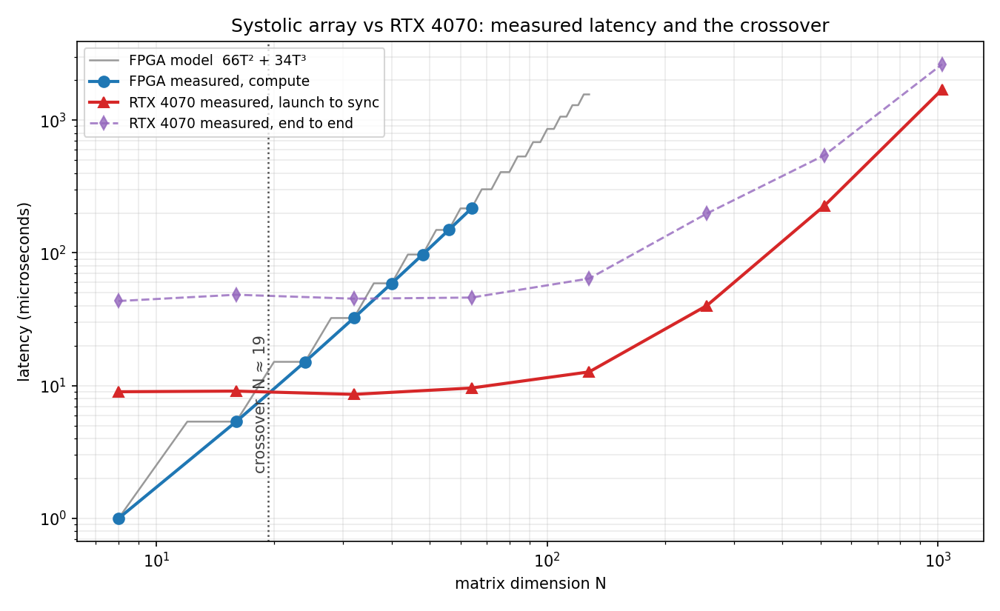

# RTL MAC Accelerator
## Table of Contents:
- [Introduction](#introduction)
- [Motivation](#motivation)
- [Tech Stack](#tech-stack)
- [Results & Validation](#results--validation)
- [Technical Highlights](#technical-highlights)
    - [FPGA Hardware Design](#fpga-hardware-design)
    - [Verification Infrastructure](#verification-infrastructure)
    - [Tiling & Memory](#tiling--memory)
    - [CUDA Baseline & Characterization](#cuda-baseline--characterization)
- [Core Files & Modules](#core-files--modules)
- [Target Hardware](#target-hardware)
    - [Resources](#resources)
- [Setup](#setup)
- [Performance & Analysis](#performance--analysis)
    - [Architecture](#architecture)
    - [Implementation Results](#implementation-results)
    - [Latency & The Crossover](#latency--the-crossover)
    - [Determinism](#determinism)
    - [I/O Boundedness](#io-boundedness)
    - [Scaling Projection](#scaling-projection)
    - [Design Rationale](#design-rationale)
- [Known Limitations](#known-limitations)

## Introduction:
This repository presents a **parameterized output-stationary systolic array for
integer matrix multiplication**, implemented in SystemVerilog on a
Spartan-7. I compared performance with a CUDA baseline on an RTX 4070.

My goal was to see how performance varied between the two platforms as the matrix size increased. I hypothesized that the GPU would generally be faster than the FPGA due to the limited LUT and DSP on my personal FPGA.

To summarize my findings, the FPGA was quicker for **N < 19**, and the GPU was quicker for **N &ge; 19**. I will discuss these results in more detail below.

## Motivation:

Just over a year ago, I came up with this project idea as an introduction to HDL. I also knew that I wanted to somehow intregrate the project with C++ and Python. My first few commits to this repo are the first lines of Verilog that I've ever written. I decided to return to this project this summer now that I have a much better understanding of FPGA design and HDL. Oh, and I also have a few FPGA's that I own to play around with!


## Tech Stack:


[](#)

## Results & Validation:
I ran the complete pipeline on FPGA hardware: connected operands over the micro-USB UART, multiplication
on 64 DSP slices, results and an on-chip cycle count returned to the host and
checked against a Python golden model. I created numerous testbenches before ever using hardware, all had expected behaviors. I tested matrix sizes of **100, 536, 1512, 3232, 5900, 9720, 14896, 21632**.

| Finding | Measurement |
|---|---|
| **Crossover point** | N = 19.3 |
| **Small-matrix latency** | 1.00 us vs 8.60 us at N=8 — **8.6x faster** |
| **Latency jitter** | GPU spread 343.80 us — FPGA spread **0** across 80 runs |
| **Model accuracy** | `66T² + 34T³` reproduces all 8 measured sizes |
| **Correctness** | 65,000/65,000 |




> Measured latency for both platforms across eight matrix sizes. The GPU is flat
> at ~9 us from N=8 through N=64 because across that entire range it is not
> computing, it is launching. The grey staircase is the analytical model; it
> lands on every measured point exactly.

## Technical Highlights:
- ### FPGA Hardware Design:
    - Parameterized output-stationary systolic array
        - KxK generate nest with neighbour-only interconnect, N² multipliers
        - Uses exactly one DSP slice (DSP48E1) per processing element
    - Skew buffer
        - Lane *i* delayed *i* cycles so A[i][k] and B[k][j] meet at cell (i,j) in the same cycle
    - Minimal-width accumulators
        - `2*DATA_W + ceil(log2 K)` = 35 bits per tile, exactly minimal against the all -32768 worst case
        - 48-bit accumulation across tiles
    - Hardware design does not use any block designs or vendor IP's
- ### Verification Infrastructure:
    - Python golden model with bit-exact RTL semantics
        - Reproduces wrapping accumulator and verified with NumPy
        - Deterministic seeded vector generation
    - 3 testbench layers
        - Array level, tiling level, and full byte protocol
- ### Tiling & Memory:
    - BRAM-backed operand storage
        - One K-element word per BRAM row, so a KxK tile loads in K cycles rather than K²
        - Extends the original fixed 8x8 array to 64x64 operands
    - On-chip cycle counter
        - The FPGA measures its own compute latency
    - Streaming result output
        - Results emit tile-by-tile as they are produced, saving a full C buffer in BRAM
- ### CUDA Baseline & Characterization:
    - Accumulation arithmetic
        - int16 operands with int32 accumulation
    - 3 timing methodologies
        - Kernel-only via CUDA events, launch-to-sync wall clock, and full end-to-end w/ transfers
    - Measurement of the launch floor
        - Fixed overhead timed at at 8.70 us
    - Jitter characterization
        - Reported jitter distribution after 10,000 launches

## Core Files & Modules:
- [Processing element](/src/pe.sv) — registered pass-through plus multiply-accumulate
- [Skew buffer](/src/skew_buffer.sv) — input staircase, lane *i* delayed *i* cycles
- [Systolic array](/src/systolic_array.sv) — KxK generate nest, structure only
- [Array top](/src/matmul_top.sv) — array, skew, run FSM; one KxK product
- [Tiling controller](/src/tile_ctrl.sv) — NxN multiply on the KxK array, operands in BRAM
- [UART protocol layer](/src/tile_uart.sv) — byte protocol, operand assembly, result serialization
- [Board top](/src/top_urbana.sv) — pins, reset, status LEDs
- [Constraints](/constraints/urbana.xdc)

**Software Verification & Testbenches**
- [Golden model](/model/matmul_model.py) · [Vector generation](/model/gen_vectors.py) · [Tiled vectors](/model/gen_tiles.py)
- [Cycle-accurate RTL model](/model/sim_array.py)
- [Array testbench](/tb/tb_systolic.sv) · [Tiling testbench](/tb/tb_tile_ctrl.sv) · [Protocol testbench](/tb/tb_tile_uart.sv)

**Benchmarking**
- [CUDA baseline](/bench/matmul_bench.cu) · [Crossover model & plots](/bench/model.py)
- [Hardware sweep](/host/run_sweep.py)

## Target Hardware:
Most recently, I've been running this project on a Real Digital **Urbana board**, which has more DSP slices than my Arty A7.

| Component | Specification |
|---|---|
| FPGA | Xilinx Spartan-7 XC7S50-CSGA324 |
| DSP48E1 slices | 120 |
| Block RAM | 2,700 Kb |
| Logic cells | 52,160 |
| Clock | 100 MHz |

The GPU baseline is an **NVIDIA GeForce RTX 4070 Laptop GPU** 

### Resources:
- [Urbana Board — Real Digital](https://www.realdigital.org/hardware/urbana)
- [Urbana Board Reference Manual](https://www.realdigital.org/doc/496fed57c6b275735fe24c85de5718c2)
- [Spartan-7 Data Sheet](https://www.xilinx.com/products/silicon-devices/fpga/spartan-7.html#documentation)

## Setup:
### Simulation
```bash
python model/matmul_model.py        # golden model self-check
python model/gen_vectors.py         # 8x8 vectors
python model/gen_tiles.py           # tiled vectors
./run_sim.sh                        # iverilog, or launch_simulation in Vivado
```

### Hardware
Build a bitstream with `top_urbana` as top, program the board, then:
```bash
pip install pyserial
python host/run_sweep.py COM4 --tiles 1 2 3 4 5 6 7 8
```
> Set **FTDI latency timer to 1 ms** in Device Manager → Ports → Advanced.
> The 16 ms default more than doubles the round-trip time

### GPU baseline
```bash
nvcc -O3 -arch=sm_89 -o matmul_bench.exe bench/matmul_bench.cu
matmul_bench.exe
python bench/model.py --plot
```


## Performance & Analysis:
### Architecture:
- **Dataflow:** output-stationary — cell (i,j) owns C[i][j] while operands stream past
- **Reuse:** each operand read from memory once, used K times as it crosses the array
- **Alignment:** injection skew of *i* cycles per row, *j* per column
- **Latency:** 3K−2 cycles per KxK tile; 22 cycles at K=8
- **Numeric format:** int16 operands, 35-bit tile accumulator, 48-bit cross-tile accumulator

### Implementation Results:
| Stage | Specification | Metric / Result |
|---|---|---|
| **DSP** | One DSP48E1 per processing element | 64 / 120 (53%) |
| **Fabric** | Operand registers | ~6,000 FF (9%), array core costs no fabric |
| **Timing** | 10.000 ns period | **WNS +1.355 ns → 115.7 MHz Fmax** |
| **Peak throughput** | 64 MACs x 2 ops x 100 MHz | 12.8 GOPS |
| **Achieved throughput** | Measured at N=64 | 2.42 GOPS (19% of peak) |

The design is **DSP-limited, not timing-limited** — K=10 would need 100 DSPs
(83%)

### Latency & Crossover:

| N | FPGA cycles | FPGA | GPU | Winner |
|---|---|---|---|---|
| 8 | 100 | 1.00 us | 8.60 us | **FPGA, 8.6x** |
| 16 | 536 | 5.36 us | 8.60 us | **FPGA, 1.6x** |
| **19** | — | — | — | **crossover** |
| 24 | 1,512 | 15.12 us | 8.60 us | GPU, 1.8x |
| 32 | 3,232 | 32.32 us | 8.60 us | GPU, 3.8x |
| 40 | 5,900 | 59.00 us | 8.60 us | GPU, 6.9x |
| 48 | 9,720 | 97.20 us | 8.60 us | GPU, 11.3x |
| 56 | 14,896 | 148.96 us | 8.60 us | GPU, 17.3x |
| 64 | 21,632 | 216.32 us | 8.60 us | GPU, 25.2x |
| 1024 | — | — | 1,702 us | GPU |

The FPGA's cost decomposes exactly:
```
cycles = 66·T² + 34·T³          where T = N/K
```
- **34 cycles per tile-multiply** (×T³) — 9 load, 24 array round trip, 1 accumulate
- **66 cycles per output tile** (×T²) — 64 to stream the result out, 2 control

This reproduces **every measured sizes with zero error**, in
both simulation and on hardware. Solving it against the GPU's measured launch
floor gives **N_crossover = 19.3** — and the measurements bracket it tightly, at
N=16 where the FPGA still wins 1.6x and N=24 where the GPU wins 1.8x.

### Determinism:
10,000 consecutive GPU launches at N=64, against 80 hardware runs:

| Metric | GPU | FPGA |
|---|---|---|
| Minimum | 8.40 us | 216.32 us |
| Median | 9.00 us | 216.32 us |
| 99th percentile | 69.80 us | 216.32 us |
| Maximum | 352.20 us | 216.32 us |
| Spread | 343.80 us | 0 |

The GPU's p99 is 7.8x its own median and its worst case 39x: scheduler
contention, clock boost transitions, competing processes

### I/O Boundedness:
| N | Compute | Round trip | Array idle |
|---|---|---|---|
| 8 | 1.00 us | 6.86 ms | 99.985% |
| 16 | 5.36 us | 26.53 ms | 99.980% |
| 24 | 15.12 us | 58.47 ms | 99.974% |
| 32 | 32.32 us | 103.21 ms | 99.969% |
| 40 | 59.00 us | 161.25 ms | 99.963% |
| 48 | 97.20 us | 231.65 ms | 99.958% |
| 56 | 148.96 us | 314.84 ms | 99.953% |
| 64 | 216.32 us | 410.86 ms | 99.947% |

Machine balance is 12.8 GOPS against a 12.5 MB/s link: 1,024 operations per
byte. Matmul's arithmetic intensity is N/4 ops per byte, so the two are equal
only at N=4096.

> An earlier measurement put the 8x8 round trip at 15.4 ms. Two thirds of that
> was the FTDI latency timer. Changing the driver setting cut it
> to 6.5 ms, after which 88% of the round trip is raw serial bit time.


### Design Rationale:
**Output-stationary dataflow**: Keeping the accumulator fixed and streaming
operands past it means each value is fetched from memory once and reused K times
in transit. The alternative, weight-stationary, is better when the same weights
are reused across many inputs, but it adds a weight-load phase that a general
matmul benchmark would pay for on every tile.


**BRAM-backed tiling**: Holding whole operand matrices in registers costs 4,288
flip-flops and caps the problem size at the array dimension. BRAM was required to continue scaling, leaving the flip-flops for control logic alone.


**Streaming results instead of buffering**: Emitting each output tile as it is
produced avoids a full C buffer in BRAM. It also forced the cycle count to the
end of the response. Sending it first would require knowing it before the run
finished, which deadlocks against a controller that blocks on backpressure.

## Known Limitations:

- **N ≤ 64.** `MAX_T = 8` in the current build. The RTL supports N = 128 within
  BRAM, but has not been implemented yet
- **Achieved throughput is 19% of peak.** Tile load costs 9 of every 34 cycles
  and the array drains between tiles instead of streaming back-to-back.
  Double-buffering the load and overlapping emit with compute would recover most
  of it.
